# SEM-Project
Project Assessment

Group 9 - Team Member:

Product Owner: Giovanmaria Scanu

Scrum Master: Matthew Skilling

| ID | Task                                                                                                                     | Screen                   |
|----|--------------------------------------------------------------------------------------------------------------------------|--------------------------|
| 1  | List Country in the World - largest to smallest.                                                                         | 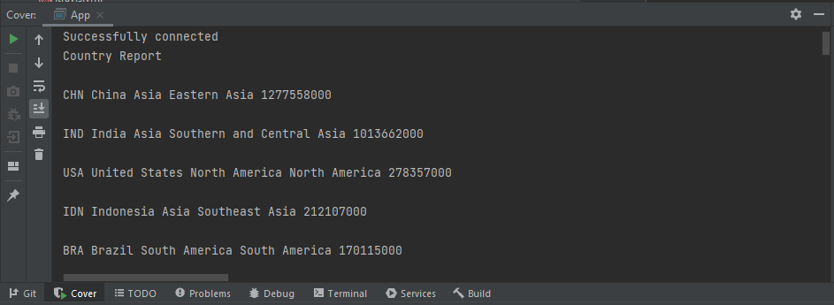   |
| 2  | List Country in the continent - largest to smallest.                                                                     | 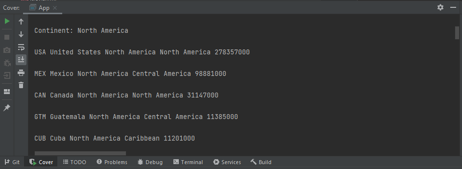   |
| 3  | List Country in the Region - largest to smallest.                                                                        | 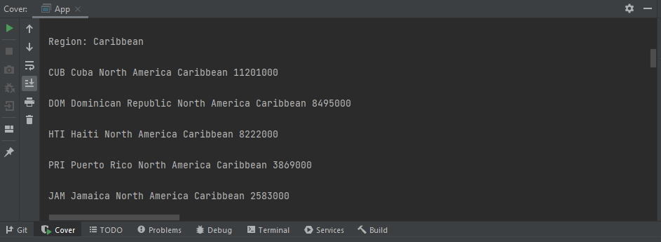   |
| 4  | List Top N populated country in the world. (N) defined by user.                                                          |    |
| 5  | List Top N populated country in the continent. (N) defined by user.                                                      |    |
| 6  | List Top N populated country in the region. (N) defined by user.                                                         |    |
| 7  | List all the cities in the world organised by largest population to smallest.                                            | 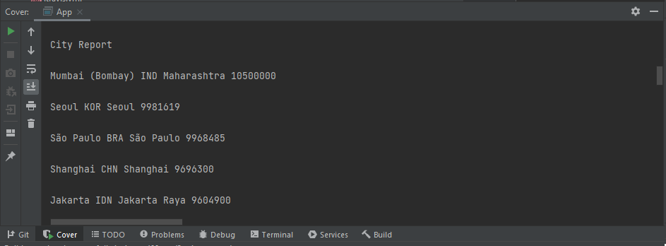  |
| 8  | List all the cities in the continet organised by largest population to smallest.                                         | 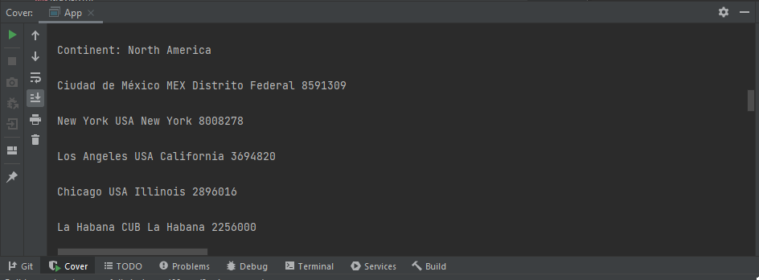  |
| 9  | List all the cities in the region organised by largest population to smallest.                                           | 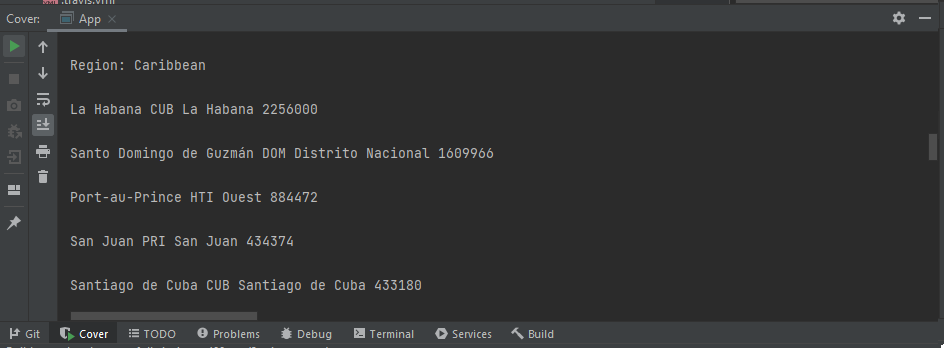  |
| 10 | List all the cities in the country organised by largest population to smallest.                                          | 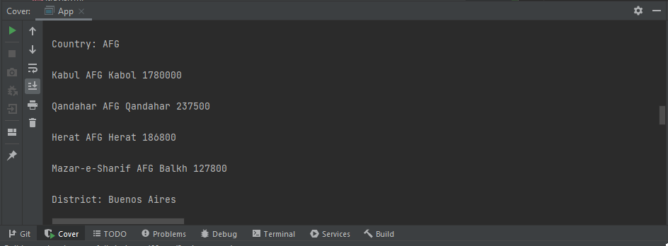 |
| 11 | List all the cities in the district organised by largest population to smallest.                                         | 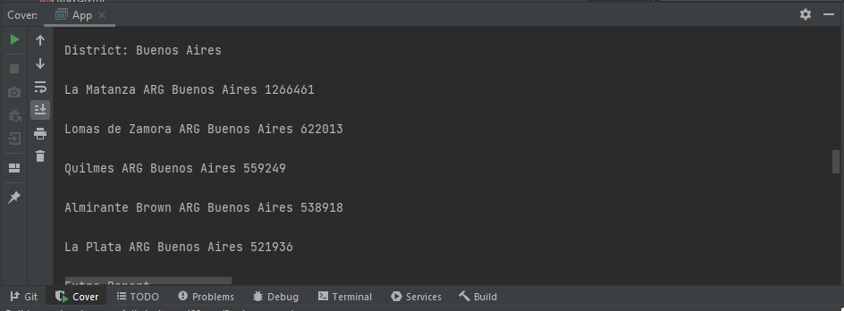 |
| 12 | List Top N populated cities in the world. (N) defined by user.                                                           |   |
| 13 | List Top N populated cities in the continet. (N) defined by user.                                                        |   |
| 14 | List Top N populated cities in the region. (N) defined by user.                                                          |   |
| 15 | List Top N populated cities in the country. (N) defined by user.                                                         |  |
| 16 | List Top N populated cities in the district. (N) defined by user.                                                        |  |
| 26 | Access to world population.                                                                                              | 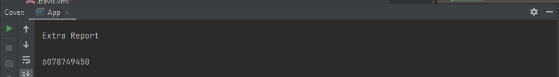    |
| 27 | Access to continets population.                                                                                          | 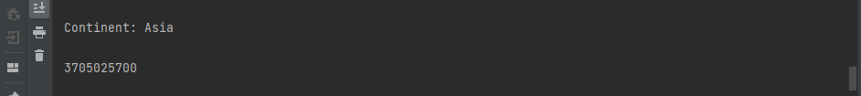    |
| 28 | Access to regions population.                                                                                            | 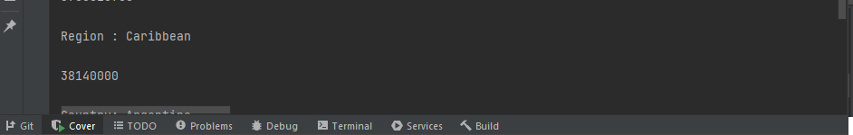    |
| 29 | Access to countries population.                                                                                          | 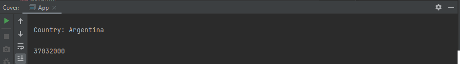    |
| 30 | Access to discricts population.                                                                                          | 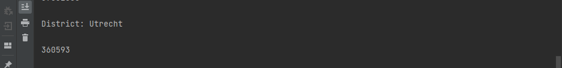    |
| 31 | Access to cities population.                                                                                             | 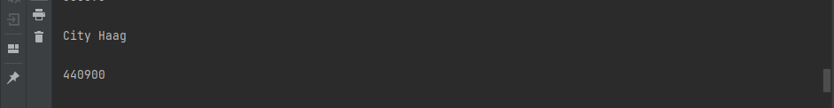    |
| 32 | Number of people and world percentage of Chinese, English, Hindi, Spanish and Arabic language user. Greater to smallest. | 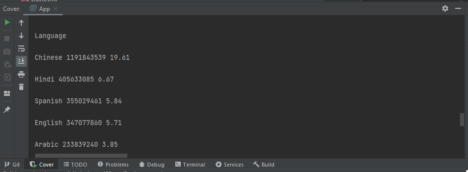 |
| 17 | List all capital cities in the world - largest to smallest.                                                              | 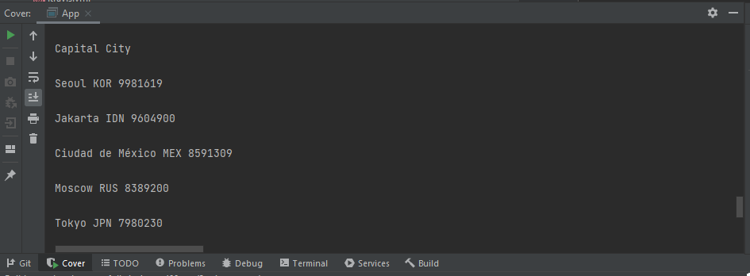 |
| 18 | List all capital cities in a continent - largest to smallest.                                                            | 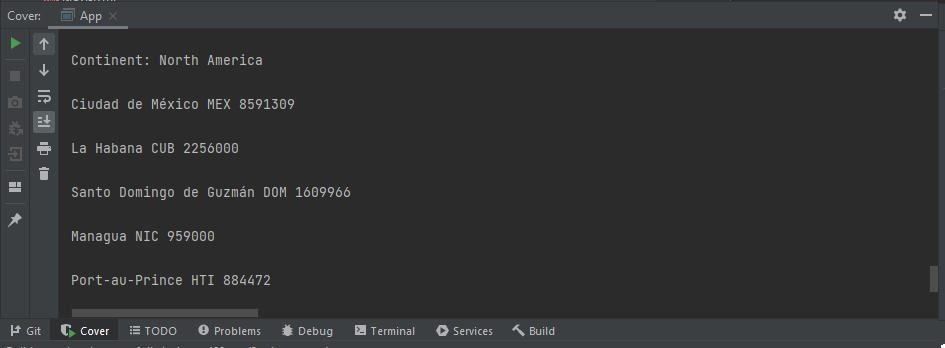 |
| 19 | List all capital cities in a district - largest to smallest.                                                             | 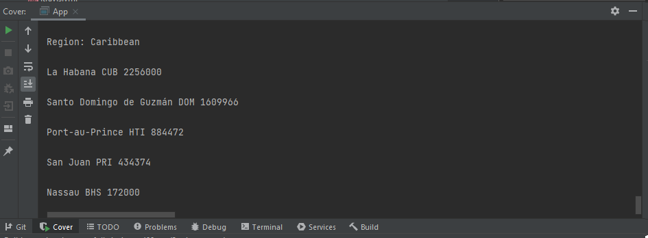 |
| 20 | List Top N populated capital cities in the world. (N) defined by user.                                                   |  |
| 21 | List Top N populated capital cities in a continet. (N) defined by user.                                                  |  |
| 22 | List Top N populated capital cities in a region. (N) defined by user.                                                    |  |

- Master Build Status  
  

- Develop Build Status   
  

- License  
  

- Release  
  